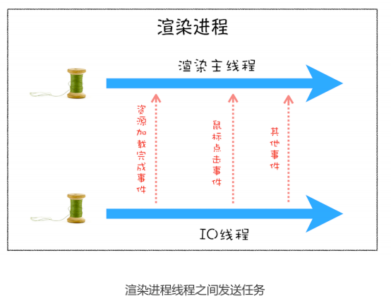
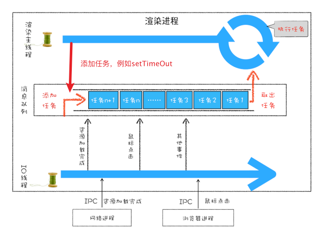

### 简介
每个渲染进程都有一个主线程，并且主线程非常繁忙，既要处理 DOM，又要计算样式，还要处理布局，同时还需要处理 JavaScript 任务以及各种输入事件。要让这么多不同类型的任务在主线程中有条不紊地执行，这就需要一个系统来统筹调度这些任务，这个统筹调度系统就是我们今天要讲的**消息队列**和**事件循环系统**。
### 出现原因
- 事件循环机制

  要想在线程运行过程中，能接收并执行新的任务，就需要采用事件循环机制

- 消息队列

  

  ​	从上图可以看出，渲染主线程会频繁接收到来自于 IO 线程的一些任务，接收到这些任务之后，渲染进程就需要着手处理，比如接收到资源加载完成的消息后，渲染进程就要着手进行DOM 解析了；接收到鼠标点击的消息后，渲染主线程就要开始执行相应的 JavaScript 脚本来处理该点击事件。那么如何设计好一个线程模型，能让其能够接收其他线程发送的消息呢？

  ​	一个通用模式是使用**消息队列**。

  ### 事件循环及消息队列图示

  

