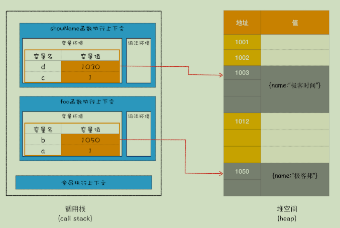
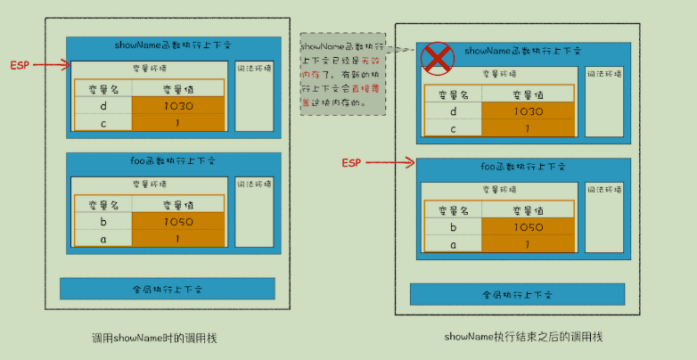
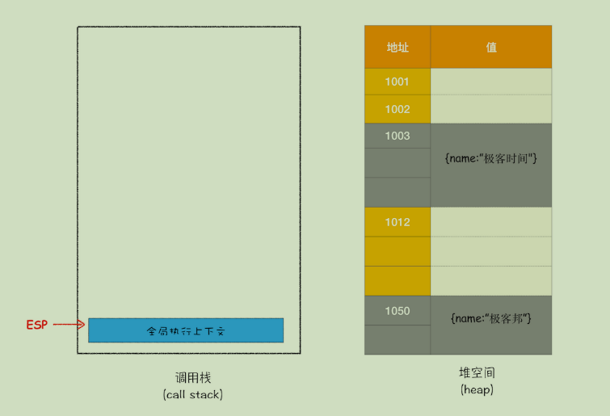
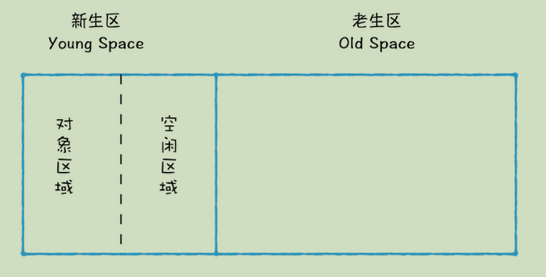
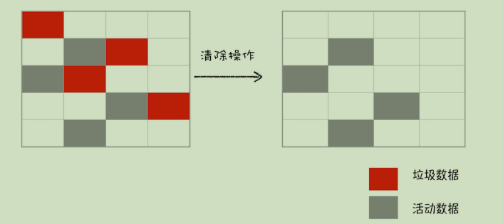
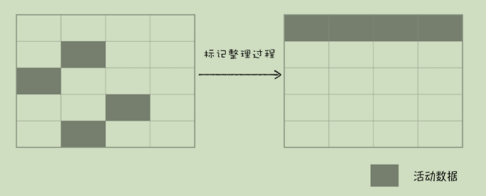
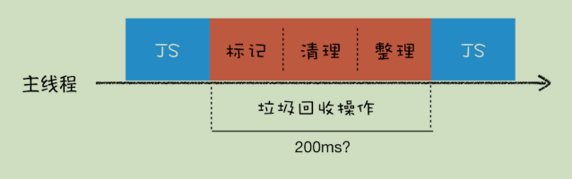
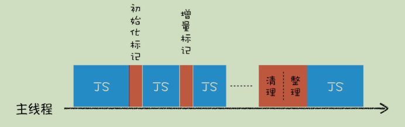
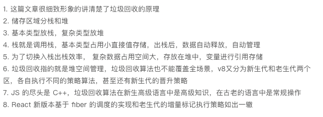

> 在V8原理中 22小节 有一些增量知识--回收效率

在JavaScript中**产生的垃圾数据是由垃圾回收器来释放的**，并不需要手动通过代码来释放。

我们知道JavaScript的数据分为两类，**原始数据类型是存储在栈空间中的，引用类型的数据是存储在堆空间中的**。

## 垃圾回收机制

### **栈中的数据是如何回收的**

在blog中有关于介绍**执行上下文(调用栈)的详细介绍，栈中的垃圾回收，我们通过一段代码来看一下

````javascript
function foo(){
 var a = 1
 var b = {name:" 极客邦 "}
 function showName(){
  var c = " 极客时间 "
  var d = {name:" 极客时间 "}
 }
 showName()
}
foo()
````

当执行到第 6 行代码时，其调用栈和堆空间状态图如下所示：



当showName执行完毕，上下文需要切换至foo时，有一个**记录当前执行状态的指针（称为 ESP）**会下移指向foo函数的执行上下文，虽然showName的执行上下文未被摧毁，但是已经是无效内存了。因为如果当foo 函数再次调用另外一个函数时，这块内容会被直接覆盖掉，用来存放另外一个函数的执行上下文



#### 结论

 在栈空间中，**JavaScript 引擎会通过向下移动 ESP 来销毁该函数保存在栈中的执行上下文，顺带完成了栈空间的垃圾回收**。

### **堆中的数据是如何回收的**

继续上边代码的执行，当上面那段代码的 foo 函数执行结束之后，ESP 应该是指向全局执行上下文的，那这样的话，showName 函数和 foo 函数的执行上下文就处于无效状态了，**不过保存在堆中的两个对象依然占用着空间**，如下图所示：



**要回收堆中的垃圾数据，就需要用到 JavaScript 中的垃圾回收器了**。

#### 代际假说

 **代际假说（The Generational Hypothesis）**，这是垃圾回收领域中一个重要的术语，后续垃圾回收的策略都是建立在该假说的基础之上的。

**代际假说**有以下两个特点：

- 第一个是大部分对象在内存中存在的时间很短，简单来说，就是很多对象一经分配内存，很快就变得不可访问；

- 第二个是不死的对象，会活得更久。

#### 分代收集

在 V8 中会把堆分为**新生代**和**老生代**两个区域，**新生代中存放的是生存时间短的对象，老生代中存放的生存时间久的对象**。

- **副垃圾回收器，主要负责新生代的垃圾回收。**

- **主垃圾回收器，主要负责老生代的垃圾回收。**

#### 统一的回收流程

 不论什么类型的垃圾回收器，它们都有一套共同的执行流程

- 标记空间中活动对象和非活动对象。所谓活动对象就是还在使用的对象，非活动对象就是可以进行垃圾回收的对象。

- 回收非活动对象所占据的内存。其实就是在所有的标记完成之后，统一清理内存中所有被标记为可回收的对象。

- 第三步是做内存整理。一般来说，频繁回收对象后，内存中就会存在大量不连续空间，我们

  把这些不连续的内存空间称为**内存碎片**。（**副垃圾回收器不会产生内存碎片**）

#### **副垃圾回收器**

 副垃圾回收器主要负责新生区的垃圾回收。大多数小的对象都会被分配到新生区，所以说这个**区域虽然不大**，但是垃圾回收还是比较**频繁**的。

 新生代中用**Scavenge 算法**来处理。所谓 Scavenge 算法，是把新生代空间对半划分为两个区域，一半是对象区域，一半是空闲区域，如下图所示：



新加入的对象都会存放到对象区域，当对象区域快被写满时，就需要执行一次垃圾清理操作。

 在垃圾回收过程中，首先要对对象区域中的垃圾做标记；标记完成之后，就进入垃圾清理阶段，副垃圾回收器会把这些存活的对象复制到空闲区域中，同时它还**会把这些对象有序地排列起来**，所以这个复制过程，也就相当于完成了内存整理操作，复制后空闲区域就没有内存碎片了。

 完成复制后，对象区域与空闲区域进行角色翻转，这样就完成了垃圾对象的回收操作，同时这种**角色翻转的操作还能让新生代中的这两块区域无限重复使用下去**。

> 复制操作需要时间成本，**为了执行效率，一般新生区的空间会被设置得比较小**

##### 对象晋升策略

 JavaScript 引擎采用了**对象晋升策略**，也就是经过两次垃圾回收依然还存活的对象，会被移动到老生区中

#### **主垃圾回收器**

 主垃圾回收器主要负责老生区中的垃圾回收。除了新生区中晋升的对象，**一些大的对象会直接被分配到老生区**。因此老生区中的对象有两个特点，一个是**对象占用空间大**，另一个是**对象存活时间长**。

 由于老生去对象比较大，不适合新生去的回收机制，主垃圾回收器是采用标记-清除算法

##### 标记 - 清除

 首先是标记过程阶段。标记阶段就是从一组根元素开始，递归遍历这组根元素（**调用栈**），在这个遍历过程中，能到达的元素称为**活动对象**，没有到达的元素就可以判断为**垃圾数据**。

 接下来就是垃圾的清除过程。它和副垃圾回收器的垃圾清除过程完全不同，你可以理解这个过程是清除掉红色标记数据的过程，可参考下图大致理解下其清除过程：



不过对一块内存多次执行标记 - 清除算法后，会**产生大量不连续的内存碎片**，于是又产生了另外一种算法——**标记 - 整理（Mark-Compact）**

 这个标记过程仍然与标记 - 清除算法里的是一样的，但后续步骤不是直接对可回收对象进行清理，而是让所有存活的对象都向一端移动，然后直接清理掉端边界以外的内存。你可以参考下图：



#### **全停顿**

 JavaScript 是运行在主线程之上的，一旦执行垃圾回收算法，都需要将正在执行的JavaScript 脚本暂停下来，待垃圾回收完毕后再恢复脚本执行。我们把这种行为叫做**全停顿（Stop-The-World）**。



一般来说是老生代的垃圾回收占用时间较长，新生代可以忽略不计。为了解决这个问题，V8使用了**增量标记（Incremental Marking）算法**。



V8 将**标记过程**分为一个个的子标记过程，同时让垃圾回收标记和 JavaScript 应用逻辑交替进行，直到标记阶段完成。这样当执行复杂动画效果时，就不会让用户因为垃圾回收任务而感受到页面的卡顿了。

> 精彩评论
>
> 
