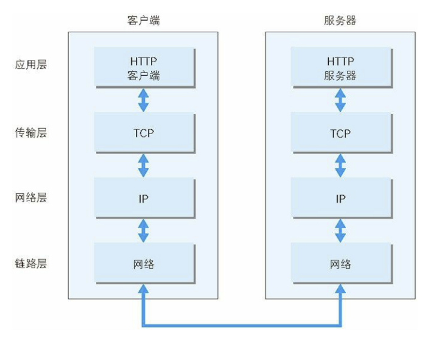

## 进程和线程

​	启动一个程序的时候，操作系统会为该程序创建一块内存，用来存放代码、运行中的数据和一个执行任务的主线程，我们把这样的一个运行环境叫进程

- **一个进程就是一个程序的运行实例**
- **线程是不能单独存在的，它是由进程来启动和管理的**
- **线程是依附于进程的，而进程中使用多线程并行处理能提升运算效率**

总结来说，进程和线程之间的关系有以下 4 个特点。

- **1. 进程中的任意一线程执行出错，都会导致整个进程的崩溃。**
- **2. 线程之间共享进程中的数据。**
- **3. 当一个进程关闭之后，操作系统会回收进程所占用的内存(包括泄漏的内存)。**
- **4. 进程之间的内容相互隔离。(通信依靠IPC进程间通信)**

## 网络协议

### 常见网页协议

-  **TCP/IP**  是互联网相关的各类协议族的总称
-  **IP**（Internet Protocol）网际协议（**网络层协议**）IP 协议的作用是把各种数据包传送给对方。而要保证确实传送到对方 那里，则需要满足各类条件。其中两个重要的条件是 IP 地址和 MAC 地址（Media Access Control Address）
-  **HTTP** 超文本传输协议是一个用于传输超媒体文档（例如 HTML）的**应用层协议**。它是为 Web 浏览器与 Web 服务器之间的通信而设计的，但也可以用于其他目的
-  **TCP**（Transmission Control Protocol，传输控制协议）是一种面向连接的、可靠的、基于字节流的**传输层通信协议**
-  **UDP**（User Data Protocol，用户数据报协议）一个非连接的协议，传输数据之前源端和终端不建立连接， 当它想传送时就简单地去抓取来自应用程序的数据，并尽可能快地把它扔到网络上

###  **TCP/IP** 的分层管理 

**利用 TCP/IP 协议族进行网络通信时，会通过分层顺序与对方进行通信**

这些层基本上被分为4层：

- 应用层

  - 1、超文本传输协议（**HTTP**):万维网的基本协议
  - 2、文件传输（FTP文件传输协议）；
  - 3、远程登录（Telnet），提供远程访问其它主机功能, 它允许用户登录internet主机，并在这台主机上执行命令
  - 4、网络管理（SNMP简单网络管理协议），该协议提供了监控网络设备的方法， 以及配置管理,统计信息收集,性能管理及安全管理等
  - 5、域名系统（**DNS**），该系统用于在internet中将域名及其公共广播的网络节点转换成IP地址

- 传输层

  - 1、**TCP**
  - 2、**UDP**

- 网络层

  - 1、Internet协议（IP）
  - 2、Internet控制信息协议（ICMP）
  - 3、地址解析协议（ARP）ARP 是一种用以解析地址的协议，根据通信方的 IP 地址就可以反查出对应的 MAC 地址。
  - 4、反向地址解析协议（RARP）

- 链路层

  用来处理连接网络的硬件部分。包括控制操作系统、硬件的设备驱动、NIC（Network Interface Card，网络适配器，即网卡），及光纤等物理可见部分（还包括连接器等一切传输媒介）。硬件上的范畴均在链路层的作用范围之内。 

## 层叠上下文

- 文档根元素（`<html>`）；
- [`position`](https://developer.mozilla.org/zh-CN/docs/Web/CSS/position) 值为 `absolute`（绝对定位）或 `relative`（相对定位）且 [`z-index`](https://developer.mozilla.org/zh-CN/docs/Web/CSS/z-index) 值不为 `auto` 的元素；
- [`position`](https://developer.mozilla.org/zh-CN/docs/Web/CSS/position) 值为 `fixed`（固定定位）或 `sticky`（粘滞定位）的元素（沾滞定位适配所有移动设备上的浏览器，但老的桌面浏览器不支持）；
- flex ([`flexbox` (en-US)](https://developer.mozilla.org/en-US/docs/Web/CSS/CSS_Flexible_Box_Layout/Basic_Concepts_of_Flexbox)) 容器的子元素，且 [`z-index`](https://developer.mozilla.org/zh-CN/docs/Web/CSS/z-index) 值不为 `auto`；
- grid ([`grid`](https://developer.mozilla.org/zh-CN/docs/Web/CSS/grid)) 容器的子元素，且 [`z-index`](https://developer.mozilla.org/zh-CN/docs/Web/CSS/z-index) 值不为 `auto`；
- [`opacity`](https://developer.mozilla.org/zh-CN/docs/Web/CSS/opacity) 属性值小于 `1` 的元素（参见 [the specification for opacity](https://www.w3.org/TR/css3-color/#transparency)）；
- [`mix-blend-mode`](https://developer.mozilla.org/zh-CN/docs/Web/CSS/mix-blend-mode) 属性值不为 `normal` 的元素；
- 以下任意属性值不为none的元素：
  - [`transform`](https://developer.mozilla.org/zh-CN/docs/Web/CSS/transform)
  - [`filter`](https://developer.mozilla.org/zh-CN/docs/Web/CSS/filter)
  - [`perspective`](https://developer.mozilla.org/zh-CN/docs/Web/CSS/perspective)
  - [`clip-path`](https://developer.mozilla.org/zh-CN/docs/Web/CSS/clip-path)
  - [`mask`](https://developer.mozilla.org/zh-CN/docs/Web/CSS/mask) / [`mask-image`](https://developer.mozilla.org/zh-CN/docs/Web/CSS/mask-image) / [`mask-border`](https://developer.mozilla.org/zh-CN/docs/Web/CSS/mask-border)
- [`isolation`](https://developer.mozilla.org/zh-CN/docs/Web/CSS/isolation) 属性值为 `isolate` 的元素；
- [`-webkit-overflow-scrolling`](https://developer.mozilla.org/zh-CN/docs/Web/CSS/-webkit-overflow-scrolling) 属性值为 `touch` 的元素；
- [`will-change`](https://developer.mozilla.org/zh-CN/docs/Web/CSS/will-change) 值设定了任一属性而该属性在 non-initial 值时会创建层叠上下文的元素（参考[这篇文章](https://dev.opera.com/articles/css-will-change-property/)）；
- [`contain`](https://developer.mozilla.org/zh-CN/docs/Web/CSS/contain) 属性值为 `layout`、`paint` 或包含它们其中之一的合成值（比如 `contain: strict`、`contain: content`）的元素。

## [**同源**的**定义**](https://developer.mozilla.org/zh-CN/docs/Web/Security/Same-origin_policy#同源的定义)

如果两个 URL 的 [protocol](https://developer.mozilla.org/zh-CN/docs/Glossary/Protocol)、[port (en-US)](https://developer.mozilla.org/en-US/docs/Glossary/Port) (如果有指定的话)和 [host](https://developer.mozilla.org/zh-CN/docs/Glossary/Host) 都相同的话，则这两个 URL 是*同源*。这个方案也被称为“协议/主机/端口元组”，或者直接是 “元组”。（“元组” 是指一组项目构成的整体，双重/三重/四重/五重/等的通用形式）。

下表给出了与 URL `http://store.company.com/dir/page.html` 的源进行对比的示例:

| URL                                               | 结果 |                               原因 |
| :------------------------------------------------ | :--- | ---------------------------------: |
| `http://store.company.com/dir2/other.html`        | 同源 |                       只有路径不同 |
| `http://store.company.com/dir/inner/another.html` | 同源 |                       只有路径不同 |
| `https://store.company.com/secure.html`           | 失败 |                           协议不同 |
| `http://store.company.com:81/dir/etc.html`        | 失败 | 端口不同 ( `http://` 默认端口是80) |
| `http://news.company.com/dir/other.html`          | 失败 |                           主机不同 |

## 位(bit) & 字节(Byte)

[详细](https://juejin.cn/post/7002088412903637022#heading-2)

### bit

1位二进制数，也就是1bit，有2种可能，可以表示数0,1 **也就是开关状态 是计算机的存储基础**

2位二进制数，2bit，有4种可能(2x2)，可以表示数0,1,2,3

3位二进制数,3bit，有8种可能(2x2x2)，可以表示数0,1,2,3,4,5,6,7

### Byte

大B，表示字节

1Byte = 8 bit, 2^8是256，1个字节能表示的数就是0-255,共256种可能性。

## Unicode编码

[摘抄](https://juejin.cn/post/6844903590155272199#heading-3)

### 概念

​	Unicode（统一码、万国码、单一码）是计算机科学领域里的一项业界标准,包括字符集、编码方案等。Unicode 是为了解决传统的字符编码方案的局限而产生的，它为每种语言中的每个字符设定了统一并且唯一的二进制编码，以满足跨语言、跨平台进行文本转换、处理的要求。

### UTF-8

#### 概念

UTF-8（**8-bit Unicode Transformation Format**）是一种针对Unicode的可变长度字符编码，又称万国码。UTF-8 **用1到6个字节编码Unicode字符**。用在网页上可以统一页面显示中文简体繁体及其它语言（如英文，日文，韩文）。

> UTF-8是一种非常通用的**可变长**字符编码方式
>
> 像UTF-8里面，ASCII所表示的字符集就是用1 Byte来表示，而大部分汉字则是用3 Byte来表示。

### UTF-16

#### 概念

> UTF-16 Unicode字符编码五层次模型的第三层：字符编码表（Character Encoding Form，也称为 "storage format"）的一种实现方式。即把Unicode字符集的抽象码位映射为16位长的二进制整数（即码元， 长度为2 Byte）的序列，用于数据存储或传递。Unicode字符的码位，需要1个或者2个16位长的码元来表示，因此这是一个变长表示。

引用维基百科中对于UTF-16编码的解释我们可以知道，UTF-16最少也会用2 Byte来表示一个字符，因此没有办法兼容ASCII编码（ASCII编码使用1 Byte来进行存储）。

### JS中的string

在JavaScript中，所有的string类型（或者被称为DOMString）都是使用UTF-16编码的。

因此，当我们需要转换成二进制与后端进行通信时，需要注意相关的编码方式。