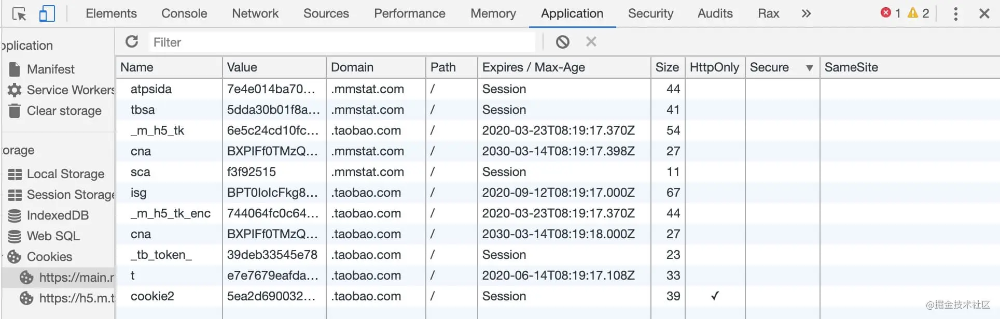
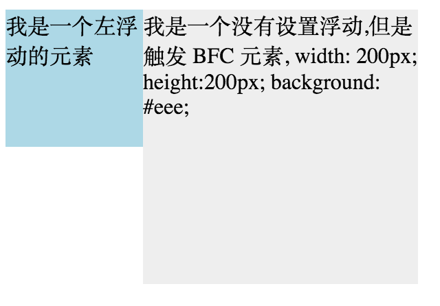

## 进程和线程

 启动一个程序的时候，操作系统会为该程序创建一块内存，用来存放代码、运行中的数据和一个执行任务的主线程，我们把这样的一个运行环境叫进程

- **一个进程就是一个程序的运行实例**
- **线程是不能单独存在的，它是由进程来启动和管理的**
- **线程是依附于进程的，而进程中使用多线程并行处理能提升运算效率**


总结来说，进程和线程之间的关系有以下 4 个特点。

- **1. 进程中的任意一线程执行出错，都会导致整个进程的崩溃。**
- **2. 线程之间共享进程中的数据。**
- **3. 当一个进程关闭之后，操作系统会回收进程所占用的内存(包括泄漏的内存)。**
- **4. 进程之间的内容相互隔离。(通信依靠IPC进程间通信)**

## 网络协议

### 常见网页协议

- **TCP/IP**  是互联网相关的各类协议族的总称
- **IP**（Internet Protocol）网际协议（**网络层协议**）IP 协议的作用是把各种数据包传送给对方。而要保证确实传送到对方 那里，则需要满足各类条件。其中两个重要的条件是 IP 地址和 MAC 地址（Media Access Control Address）
- **HTTP** 超文本传输协议是一个用于传输超媒体文档（例如 HTML）的**应用层协议**。它是为 Web 浏览器与 Web 服务器之间的通信而设计的，但也可以用于其他目的
- **TCP**（Transmission Control Protocol，传输控制协议）是一种面向连接的、可靠的、基于字节流的**传输层通信协议**
- **UDP**（User Data Protocol，用户数据报协议）一个非连接的协议，传输数据之前源端和终端不建立连接， 当它想传送时就简单地去抓取来自应用程序的数据，并尽可能快地把它扔到网络上

### **TCP/IP** 的分层管理

**利用 TCP/IP 协议族进行网络通信时，会通过分层顺序与对方进行通信**


这些层基本上被分为4层：

- 应用层

  - 1、超文本传输协议（**HTTP**):万维网的基本协议
  - 2、文件传输（FTP文件传输协议）；
  - 3、远程登录（Telnet），提供远程访问其它主机功能, 它允许用户登录internet主机，并在这台主机上执行命令
  - 4、网络管理（SNMP简单网络管理协议），该协议提供了监控网络设备的方法， 以及配置管理,统计信息收集,性能管理及安全管理等
  - 5、域名系统（**DNS**），该系统用于在internet中将域名及其公共广播的网络节点转换成IP地址

- 传输层

  - 1、**TCP**
  - 2、**UDP**

- 网络层

  - 1、Internet协议（IP）
  - 2、Internet控制信息协议（ICMP）
  - 3、地址解析协议（ARP）ARP 是一种用以解析地址的协议，根据通信方的 IP 地址就可以反查出对应的 MAC 地址。
  - 4、反向地址解析协议（RARP）

- 链路层

  用来处理连接网络的硬件部分。包括控制操作系统、硬件的设备驱动、NIC（Network Interface Card，网络适配器，即网卡），及光纤等物理可见部分（还包括连接器等一切传输媒介）。硬件上的范畴均在链路层的作用范围之内。

## Cookies 的属性

在下面这张图里我们可以看到 Cookies 相关的一些属性：



这里主要说一些大家可能没有注意的点：

### Name/Value

用 JavaScript 操作 Cookie 的时候注意对 Value 进行编码处理。

### Expires

Expires 用于设置 Cookie 的过期时间。比如：

```
Set-Cookie: id=a3fWa; Expires=Wed, 21 Oct 2015 07:28:00 GMT;
复制代码
```

当 Expires 属性缺省时，表示是会话性 Cookie，像上图 Expires 的值为 Session，表示的就是会话性 Cookie。当为会话性 Cookie 的时候，值保存在客户端内存中，并在用户关闭浏览器时失效。需要注意的是，有些浏览器提供了会话恢复功能，这种情况下即使关闭了浏览器，会话期 Cookie 也会被保留下来，就好像浏览器从来没有关闭一样。

与会话性 Cookie 相对的是持久性 Cookie，持久性 Cookies 会保存在用户的硬盘中，直至过期或者清除 Cookie。这里值得注意的是，设定的日期和时间**只与客户端相关，而不是服务端**。

### Max-Age

Max-Age 用于设置在 Cookie 失效之前需要经过的秒数。比如：

```
Set-Cookie: id=a3fWa; Max-Age=604800;
复制代码
```

Max-Age 可以为正数、负数、甚至是 0。

如果 max-Age 属性为正数时，浏览器会将其持久化，即写到对应的 Cookie 文件中。

当 max-Age 属性为负数，则表示该 Cookie 只是一个会话性 Cookie。

当 max-Age 为 0 时，则会立即删除这个 Cookie。

假如 Expires 和 Max-Age 都存在，Max-Age 优先级更高。

### Domain

Domain 指定了 Cookie 可以送达的主机名。假如没有指定，那么默认值为当前文档访问地址中的主机部分（但是不包含子域名）。

像淘宝首页设置的 Domain 就是 .taobao.com，这样无论是 a.taobao.com 还是 b.taobao.com 都可以使用 Cookie。

在这里注意的是，不能跨域设置 Cookie，比如阿里域名下的页面把 Domain 设置成百度是无效的：

```js
Set-Cookie: qwerty=219ffwef9w0f; Domain=baidu.com; Path=/; Expires=Wed, 30 Aug 2020 00:00:00 GMT
复制代码
```

### Path

Path 指定了一个 URL 路径，这个路径必须出现在要请求的资源的路径中才可以发送 Cookie 首部。比如设置 `Path=/docs`，`/docs/Web/` 下的资源会带 Cookie 首部，`/test` 则不会携带 Cookie 首部。

**Domain 和 Path 标识共同定义了 Cookie 的作用域：即 Cookie 应该发送给哪些 URL**。

> 1.domain表示的是cookie所在的域，默认为请求的地址，如网址为www.jb51.net/test/test.aspx，那么domain默认为www.jb51.net。而跨域访问，如域A为t1.test.com，域B为t2.test.com，那么在域A生产一个令域A和域B都能访问的cookie就要将该cookie的domain设置为.test.com；如果要在域A生产一个令域A不能访问而域B能访问的cookie就要将该cookie的domain设置为t2.test.com。
>
> 2.path表示cookie所在的目录，asp.net默认为/，就是根目录。在同一个服务器上有目录如下：/test/,/test/cd/,/test/dd/，现设一个cookie1的path为/test/，cookie2的path为/test/cd/，那么test下的所有页面都可以访问到cookie1，而/test/和/test/dd/的子页面不能访问cookie2。这是因为cookie能让其path路径下的页面访问。

### Secure属性

标记为 Secure 的 Cookie 只应通过被HTTPS协议加密过的请求发送给服务端。使用 HTTPS 安全协议，可以保护 Cookie 在浏览器和 Web 服务器间的传输过程中不被窃取和篡改。

### HTTPOnly

设置 HTTPOnly 属性可以防止客户端脚本通过 document.cookie 等方式访问 Cookie，有助于避免 XSS 攻击。

### SameSite

Cookie 的`SameSite`属性用来限制第三方 Cookie，从而减少安全风险。

它可以设置三个值。

- Strict
- Lax
- None

#### Strict

`Strict`最为严格，完全禁止第三方 Cookie，跨站点时，任何情况下都不会发送 Cookie。换言之，只有当前网页的 URL 与请求目标一致，才会带上 Cookie。

 ```bash
 Set-Cookie: CookieName=CookieValue; SameSite=Strict;
 ```

这个规则过于严格，可能造成非常不好的用户体验。比如，当前网页有一个 GitHub 链接，用户点击跳转就不会带有 GitHub 的 Cookie，跳转过去总是未登陆状态。

#### Lax

`Lax`规则稍稍放宽，大多数情况也是不发送第三方 Cookie，但是导航到目标网址的 Get 请求除外。

```markup
Set-Cookie: CookieName=CookieValue; SameSite=Lax;
```

导航到目标网址的 GET 请求，只包括三种情况：链接，预加载请求，GET 表单。详见下表。

| 请求类型  |                 示例                 |    正常情况 | Lax         |
| :-------- | :----------------------------------: | ----------: | :---------- |
| 链接      |         `<a href="..."></a>`         | 发送 Cookie | 发送 Cookie |
| 预加载    | `<link rel="prerender" href="..."/>` | 发送 Cookie | 发送 Cookie |
| GET 表单  |  `<form method="GET" action="...">`  | 发送 Cookie | 发送 Cookie |
| POST 表单 | `<form method="POST" action="...">`  | 发送 Cookie | 不发送      |
| iframe    |    `<iframe src="..."></iframe>`     | 发送 Cookie | 不发送      |
| AJAX      |            `$.get("...")`            | 发送 Cookie | 不发送      |
| Image     |          ``           | 发送 Cookie | 不发送      |

设置了`Strict`或`Lax`以后，基本就杜绝了 CSRF 攻击。当然，前提是用户浏览器支持 SameSite 属性。

#### None

Chrome 计划将`Lax`变为默认设置。这时，网站可以选择显式关闭`SameSite`属性，将其设为`None`。不过，前提是必须同时设置`Secure`属性（Cookie 只能通过 HTTPS 协议发送），否则无效。

下面的设置无效。

```bash
Set-Cookie: widget_session=abc123; SameSite=None
```

下面的设置有效。

```bash
Set-Cookie: widget_session=abc123; SameSite=None; Secure
```

> cookie作者：冴羽
>
> 链接：<https://juejin.cn/post/6844904095711494151>
>
> samesite作者：阮一峰
>
> 链接：https://www.ruanyifeng.com/blog/2019/09/cookie-samesite.html

## 层叠上下文

- 文档根元素（`<html>`）；
- [`position`](https://developer.mozilla.org/zh-CN/docs/Web/CSS/position) 值为 `absolute`（绝对定位）或 `relative`（相对定位）且 [`z-index`](https://developer.mozilla.org/zh-CN/docs/Web/CSS/z-index) 值不为 `auto` 的元素；
- [`position`](https://developer.mozilla.org/zh-CN/docs/Web/CSS/position) 值为 `fixed`（固定定位）或 `sticky`（粘滞定位）的元素（沾滞定位适配所有移动设备上的浏览器，但老的桌面浏览器不支持）；
- flex ([`flexbox` (en-US)](https://developer.mozilla.org/en-US/docs/Web/CSS/CSS_Flexible_Box_Layout/Basic_Concepts_of_Flexbox)) 容器的子元素，且 [`z-index`](https://developer.mozilla.org/zh-CN/docs/Web/CSS/z-index) 值不为 `auto`；
- grid ([`grid`](https://developer.mozilla.org/zh-CN/docs/Web/CSS/grid)) 容器的子元素，且 [`z-index`](https://developer.mozilla.org/zh-CN/docs/Web/CSS/z-index) 值不为 `auto`；
- [`opacity`](https://developer.mozilla.org/zh-CN/docs/Web/CSS/opacity) 属性值小于 `1` 的元素（参见 [the specification for opacity](https://www.w3.org/TR/css3-color/#transparency)）；
- [`mix-blend-mode`](https://developer.mozilla.org/zh-CN/docs/Web/CSS/mix-blend-mode) 属性值不为 `normal` 的元素；
- 以下任意属性值不为none的元素：
  - [`transform`](https://developer.mozilla.org/zh-CN/docs/Web/CSS/transform)
  - [`filter`](https://developer.mozilla.org/zh-CN/docs/Web/CSS/filter)
  - [`perspective`](https://developer.mozilla.org/zh-CN/docs/Web/CSS/perspective)
  - [`clip-path`](https://developer.mozilla.org/zh-CN/docs/Web/CSS/clip-path)
  - [`mask`](https://developer.mozilla.org/zh-CN/docs/Web/CSS/mask) / [`mask-image`](https://developer.mozilla.org/zh-CN/docs/Web/CSS/mask-image) / [`mask-border`](https://developer.mozilla.org/zh-CN/docs/Web/CSS/mask-border)
- [`isolation`](https://developer.mozilla.org/zh-CN/docs/Web/CSS/isolation) 属性值为 `isolate` 的元素；
- [`-webkit-overflow-scrolling`](https://developer.mozilla.org/zh-CN/docs/Web/CSS/-webkit-overflow-scrolling) 属性值为 `touch` 的元素；
- [`will-change`](https://developer.mozilla.org/zh-CN/docs/Web/CSS/will-change) 值设定了任一属性而该属性在 non-initial 值时会创建层叠上下文的元素（参考[这篇文章](https://dev.opera.com/articles/css-will-change-property/)）；
- [`contain`](https://developer.mozilla.org/zh-CN/docs/Web/CSS/contain) 属性值为 `layout`、`paint` 或包含它们其中之一的合成值（比如 `contain: strict`、`contain: content`）的元素。


## BFC

**块格式化上下文（Block Formatting Context，BFC）** 是Web页面的可视CSS渲染的一部分，是块盒子的布局过程发生的区域，也是浮动元素与其他元素交互的区域。

下列方式会创建**块格式化上下文**：

- 根元素（`<html>）`
- 浮动元素（元素的 [`float`](https://developer.mozilla.org/zh-CN/docs/Web/CSS/float) 不是 `none`）
- 绝对定位元素（元素的 [`position`](https://developer.mozilla.org/zh-CN/docs/Web/CSS/position) 为 `absolute` 或 `fixed`）
- 行内块元素（元素的 [`display`](https://developer.mozilla.org/zh-CN/docs/Web/CSS/display) 为 `inline-block`）
- [`overflow`](https://developer.mozilla.org/zh-CN/docs/Web/CSS/overflow) 计算值(Computed)不为 `visible` 的块元素
- 弹性元素（[`display`](https://developer.mozilla.org/zh-CN/docs/Web/CSS/display) 为 `flex` 或 `inline-flex`元素的直接子元素）
- [`contain`](https://developer.mozilla.org/zh-CN/docs/Web/CSS/contain) 值为 `layout`、`content`或 paint 的元素
- **前边的是比较常见的**
- 表格单元格（元素的 [`display`](https://developer.mozilla.org/zh-CN/docs/Web/CSS/display) 为 `table-cell`，HTML表格单元格默认为该值）
- 表格标题（元素的 [`display`](https://developer.mozilla.org/zh-CN/docs/Web/CSS/display) 为 `table-caption`，HTML表格标题默认为该值）
- 匿名表格单元格元素（元素的 [`display`](https://developer.mozilla.org/zh-CN/docs/Web/CSS/display) 为 `table、``table-row`、 `table-row-group、``table-header-group、``table-footer-group`（分别是HTML table、row、tbody、thead、tfoot 的默认属性）或 `inline-table`）
- [`display`](https://developer.mozilla.org/zh-CN/docs/Web/CSS/display) 值为 `flow-root` 的元素
- 网格元素（[`display`](https://developer.mozilla.org/zh-CN/docs/Web/CSS/display) 为 `grid` 或 `inline-grid` 元素的直接子元素）
- 多列容器（元素的 [`column-count`](https://developer.mozilla.org/zh-CN/docs/Web/CSS/column-count) 或 [`column-width` (en-US)](https://developer.mozilla.org/en-US/docs/Web/CSS/column-width) 不为 `auto，包括 ``column-count` 为 `1`）
- `column-span` 为 `all` 的元素始终会创建一个新的BFC，即使该元素没有包裹在一个多列容器中（[标准变更](https://github.com/w3c/csswg-drafts/commit/a8634b96900279916bd6c505fda88dda71d8ec51)，[Chrome bug](https://bugs.chromium.org/p/chromium/issues/detail?id=709362)）。

块格式化上下文包含创建它的元素内部的所有内容.

块格式化上下文对浮动定位（参见 [`float`](https://developer.mozilla.org/zh-CN/docs/Web/CSS/float)）与清除浮动（参见 [`clear`](https://developer.mozilla.org/zh-CN/docs/Web/CSS/clear)）都很重要。浮动定位和清除浮动时只会应用于同一个BFC内的元素。浮动不会影响其它BFC中元素的布局，而清除浮动只能清除同一BFC中在它前面的元素的浮动。外边距折叠（[Margin collapsing](https://developer.mozilla.org/en-US/docs/Web/CSS/CSS_Box_Model/Mastering_margin_collapsing)）也只会发生在属于同一BFC的块级元素之间。

规则:

- 属于同一个 BFC 的两个相邻 Box 垂直排列
- 属于同一个 BFC 的两个相邻 Box 的 margin 会发生重叠
- BFC 中子元素的 margin box 的左边， 与包含块 (BFC) border box的左边相接触 (子元素 absolute 除外)
- BFC 的区域不会与 float 的元素区域重叠 自适应两栏布局
- 
- 计算 BFC 的高度时，浮动子元素也参与计算
- 文字层不会被浮动层覆盖，环绕于周围

应用:

- 阻止`margin`重叠
- 可以包含浮动元素 —— 清除内部浮动(清除浮动的原理是两个`div`都位于同一个 BFC 区域之中)
- 自适应两栏布局
- 可以阻止元素被浮动元素覆盖

可以参考[知乎](https://zhuanlan.zhihu.com/p/25321647)

## [**同源**的**定义**](https://developer.mozilla.org/zh-CN/docs/Web/Security/Same-origin_policy#同源的定义)

如果两个 URL 的 [protocol](https://developer.mozilla.org/zh-CN/docs/Glossary/Protocol)、[port (en-US)](https://developer.mozilla.org/en-US/docs/Glossary/Port) (如果有指定的话)和 [host](https://developer.mozilla.org/zh-CN/docs/Glossary/Host) 都相同的话，则这两个 URL 是*同源*。这个方案也被称为“协议/主机/端口元组”，或者直接是 “元组”。（“元组” 是指一组项目构成的整体，双重/三重/四重/五重/等的通用形式）。

下表给出了与 URL `http://store.company.com/dir/page.html` 的源进行对比的示例:

| URL                                               | 结果 |                               原因 |
| :------------------------------------------------ | :--- | ---------------------------------: |
| `http://store.company.com/dir2/other.html`        | 同源 |                       只有路径不同 |
| `http://store.company.com/dir/inner/another.html` | 同源 |                       只有路径不同 |
| `https://store.company.com/secure.html`           | 失败 |                           协议不同 |
| `http://store.company.com:81/dir/etc.html`        | 失败 | 端口不同 ( `http://` 默认端口是80) |
| `http://news.company.com/dir/other.html`          | 失败 |                           主机不同 |

> Cookie中的「同站」判断就比较宽松：只要两个 URL 的 eTLD+1 相同即可，不需要考虑协议和端口。其中，eTLD 表示有效顶级域名，注册于 Mozilla 维护的公共后缀列表（Public Suffix List）中，例如，.com、.co.uk、.github.io 等。eTLD+1 则表示，有效顶级域名+二级域名，例如 taobao.com 等。

## withCredentials

`withCredentials`是`XMLHttpRequest`的一个属性，表示跨域请求是否提供凭据信息(cookie、HTTP认证及客户端SSL证明等)

实际中用途就是跨域请求是要不要携带cookie

在`samesite`默认为`lax`的`chrome`80+，只设置`withCredentials`已经没用了

## 位(bit) & 字节(Byte)

[详细](https://juejin.cn/post/7002088412903637022#heading-2)

### bit

1位二进制数，也就是1bit，有2种可能，可以表示数0,1 **也就是开关状态 是计算机的存储基础**

2位二进制数，2bit，有4种可能(2x2)，可以表示数0,1,2,3

3位二进制数,3bit，有8种可能(2x2x2)，可以表示数0,1,2,3,4,5,6,7

### Byte

大B，表示字节

1Byte = 8 bit, 2^8是256，1个字节能表示的数就是0-255,共256种可能性。

## Unicode编码

[摘抄](https://juejin.cn/post/6844903590155272199#heading-3)

 Unicode（统一码、万国码、单一码）是计算机科学领域里的一项业界标准,包括字符集、编码方案等。Unicode 是为了解决传统的字符编码方案的局限而产生的，它为每种语言中的每个字符设定了统一并且唯一的二进制编码，以满足跨语言、跨平台进行文本转换、处理的要求。

### UTF-8

UTF-8（**8-bit Unicode Transformation Format**）是一种针对Unicode的可变长度字符编码，又称万国码。UTF-8 **用1到6个字节编码Unicode字符**。用在网页上可以统一页面显示中文简体繁体及其它语言（如英文，日文，韩文）。

> UTF-8是一种非常通用的**可变长**字符编码方式
>
> 像UTF-8里面，[ASCII](http://ascii.wjccx.com/)所表示的字符集就是用1 Byte来表示，而大部分汉字则是用3 Byte来表示。

### UTF-16

> UTF-16 Unicode字符编码五层次模型的第三层：字符编码表（Character Encoding Form，也称为 "storage format"）的一种实现方式。即把Unicode字符集的抽象码位映射为16位长的二进制整数（即码元， 长度为2 Byte）的序列，用于数据存储或传递。Unicode字符的码位，需要1个或者2个16位长的码元(2字节或者4字节)来表示，因此这是一个变长表示。

引用维基百科中对于UTF-16编码的解释我们可以知道，UTF-16最少也会用2 Byte来表示一个字符，因此没有办法兼容ASCII编码（ASCII编码使用1 Byte来进行存储）。

### JS中的string

在JavaScript中，所有的string类型（或者被称为DOMString）都是使用UTF-16编码的。

因此，当我们需要转换成二进制与后端进行通信时，需要注意相关的编码方式。

## 性能指标

在chrome的devtools里有很多性能指标，下面简单介绍一下这些指标

首先是可以在chrome的performance中标识的指标

- DCL (DOMContentLoaded Event)

  - 当初始的 **HTML** 文档被完全加载和解析完成之后，**`DOMContentLoaded`** 事件被触发，而无需等待样式表、图像和子框架的完全加载。(MDN的概念)
  - 更加清晰的结论是，DOMContentLoaded 事件在 html文档加载完毕，并且 html 所引用的内联 js、以及外链 js 的**同步**代码都执行完毕后触发。

- L (Onload Event)

  - **load** 应该仅用于检测一个完全加载的页面 当一个资源及其依赖资源已完成加载时，将触发load事件
  - 更加清晰的结论是，当页面 DOM 结构中的 js、css、图片，以及 js 异步加载的 js、css 、图片都加载完成之后，才会触发 load 事件。

  > 页面中引用的 js 代码如果有异步加载的 js、css、图片，是会影响 load 事件触发的。
  > video、audio、flash 不会影响 load 事件触发。

- FP (First Paint)

  - `首次绘制`: 标记浏览器渲染任何在视觉上不同于导航前屏幕内容之内容的时间点，**简而言之就是浏览器第一次发生变化的时间**

- FCP (First Contentful Paint)

  - `首次内容绘制` 标记浏览器渲染来自 DOM 第一位内容的时间点，该内容可能是文本、图像、SVG 甚至 元素.

- LCP (Largest Contentful Paint)

  - `最大内容渲染`: 代表在viewport中最大的页面元素加载的时间. LCP的数据会通过PerformanceEntry对象记录, 每次出现更大的内容渲染, 则会产生一个新的PerformanceEntry对象.(2019年11月新增)

然后是在性能分析 lighthouse中出现的六个指标,前两个在performance中也存在

- FCP (First Contentful Paint)
- LCP (Largest Contentful Paint)
- SI (Speed Index)
  - 指标用于显示页面可见部分的显示速度, 单位是时间
- TTI (Time to Interactive)
  - `可交互时间`: 指标用于标记应用已进行视觉渲染并能可靠响应用户输入的时间点.
- TBT (Total Blocking Time)
  - `页面阻塞总时长`: TBT汇总所有加载过程中阻塞用户操作的时长，在FCP和TTI之间任何long task中阻塞部分都会被汇总（超过50ms的长任务）
- CLS (Cumulative Layout Shift)
  - `累积布局偏移`: 总结起来就是一个元素初始时和其hidden之间的任何时间如果元素偏移了, 则会被计算进去，说简单点就是用户不期望的元素位置偏移。
  - 根据 Google 的介绍，CLS 问题产生的原因一般包括：
    - 图片没有宽高
    - 无尺寸的广告、嵌入式和iframes
    - 动态注入的内容
    - 导致FOIT/FOUT的Web字体
    - 在更新DOM之前等待网络响应的操作

## 对象获取属性的方法

|                       方法                       | 不可枚举属性 | 继承属性 | symbol属性 | 自身属性 |
| :----------------------------------------------: | :----------: | :------: | :--------: | :------: |
|                        in                        |      ✅       |    ✅     |     ✅      |    ✅     |
|                     for...in                     |      ❌       |    ✅     |     ❌      |    ✅     |
|                 JSON.stringfy()                  |      ❌       |    ❌     |     ❌      |    ✅     |
|                 Object.assign()                  |      ❌       |    ❌     |     ✅      |    ✅     |
|                  ... 扩展运算符                    |      ❌       |    ❌     |     ✅      |    ✅     |
| Object.keys()、Object.values()、Object.entries()  |      ❌       |    ❌     |     ❌      |    ✅     |
|           Object.getOwnPropertyNames()           |      ✅       |    ❌     |     ❌      |    ✅     |
|        Object.getOwnPropertySymbols(obj)         |      ❌       |    ❌     |     ✅      |    ❌     |
|               Reflect.ownKeys(obj)               |      ✅       |    ❌     |     ✅      |    ✅     |
|        Object.getOwnPropertyDescriptor(s)        |      ✅       |    ❌     |     ✅      |    ✅     |

## 寄生组合继承

 **避免二次调用父的prototype**

```
  // 父
  function SuperType(name) {
    this.name = name;
    this.colors = ["red", "blue", "green"];
  }
  SuperType.prototype.sayName = function () {
    console.log(this.name);
  };

 // 借助辅助原型函数链接到父prototype
 function object(o) { 
    function F() {} 
    F.prototype = o; 
    return new F(); 
  }
  // 保证正确的construct，将只prototype链接到辅助原型函数上的实例上
  function inheritPrototype(subType, superType) {
    let prototype = object(superType.prototype); // 创建对象
    prototype.constructor = subType; // 增强对象 
    subType.prototype = prototype; // 赋值对象
  }
  
 // 继承
  function SubType(name, age) {
   // 一
    SuperType.call(this, name);
    this.age = age;
  }
  // 二
  inheritPrototype(SubType, SuperType);
  
  SubType.prototype.sayAge = function () {
    console.log(this.age);
  };
  var child = new SubType("头疼", 30)
```
